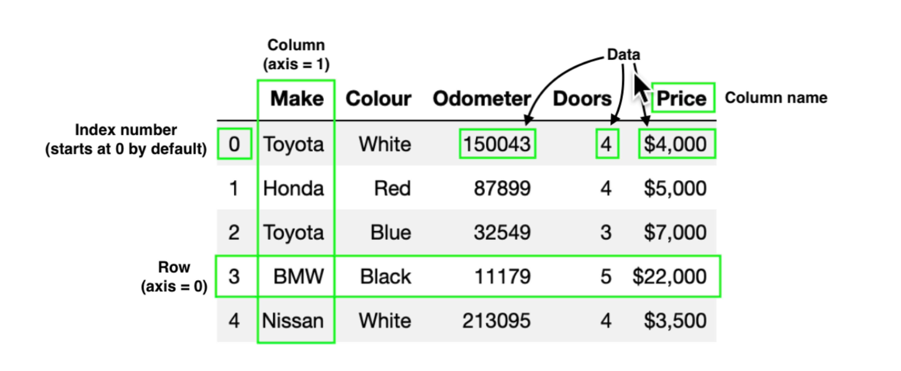

# Pandas Basics

Pandas is a python library used for analyzing, cleaning, exploring, and manipulating data.

## Why pandas?

- Simple to use.
- Integrated with many other data science and ML python tools.
- Helps you get your date ready for machine learning.

---

## Types of Data

Let's open our Jupyter Home and start working in Pandas.

Create a new Notebook named 'introduction-to-pandas'

There are two main types of data in pandas:-

### 1. Series:

Series is 1 dimensional that stores python list.

```python
import pandas as pd

cars = pd.Series(["BMW","Toyota","Honda"])
colors = pd.Series(["Red","Blue","White"])

# To view them - 
cars
colors
```

### 2. Data Frame

Data Frames is 2 dimensional that stores python dictionary.

```python
import pandas as pd

# We can use series to create data frame
car_data = pd.DataFrame({
"Car Company": cars,
"Color" : colors,
})

# To view it - 
car_data
```
--- 

## Importing and Exporting a csv file

```python
# Import
car_sales = pd.read_csv("car-sales.csv")

car_sales

# import from link
car_sales = pd.read_csv("link-to-csv/car-sales.csv")
```

```python
# Export to csv
car_sales.to_csv("exported-car-sales.csv", index = False)

# Export to excel
!pip install openpyxl # run this in a cell to get the package

car_sales.to_excel("exported-car-sales.", index = False)
```

*Why index = False*
*By default, export function is going to add a new column for index. index = False is going to prevent that.*
--- 

## Anatomy of a DataFrame

- Index number starts from 0
- It is consist of rows and columns
- Rows are considered as axis 0
- Columns are considered as axis 1



---

## Describe Data

### To get data type of all the columns 

```python
car_sales.dtypes
```

### To get list of all the columns

```python
car_columns = car_sales.columns

car_columns # This is going to return a list of all the columns
```

### To get index data

```python
car_sales.index

# will return something like - RangeIndex(start = 0, stop = 10, step = 1)
```

### To get description about DataFrame

```python
car_sales.describe()
```

describe() only works on numerical columns and it will provide with basic information like count, mean, std etc.


### To get info of the DataFrame

```python
car_sales.info()
```

This is going to return some basic information about columns like their names, total count, null or not null, and data types.

### To get mean value of all the numeric columns

```python
car_sales.mean(numeric_only = True)
```


### To sum the values of data frame

```python
car_sales.sum()
```

This will sum all the numeric columns but just join all the other types of columns.

To do it on single column - 

```python
car_sales["Doors"].sum() # Other functions can be called in same way
```

### To get the length of the DataFrame

```python
len(car_sales)
```

## Selecting and Viewing Data

### Return top rows of data frame

`car_sales.head()`

You can also insert the numbers of rows you want

`car_sales.head(10)`

This will return first 10 rows of the data frame

### Return bottom rows of data frame 

`car_sales.tail(10)`

This will return last 10 rows of the data frame

### .loc and .iloc

.loc returns the row at provided index(based on value of index column)  

`car_sales.loc[3]`

This will return the row where value of index column in 3, it could be more than on if provided custom indexes.

*Create a series with custom index to try:*

```python
animals = pd.Series(["dog", "cat", "panda", "snake"], index = [0, 3, 3 , 9])  
```

`animals.loc[3]`  

This will return two rows of cat and panda because both of them have index value of 3

.iloc returns the row at actual provided index(actual index from 0 to length-1)   

`animals.iloc[3]` 

This will return snake because it has the actual index of 3.

We can also slice using iloc   

`animals.iloc[:2]`  

This will return all the rows till index 2(not inclusive)

`animals.loc[:2]`

This will return upto and including 2

### Two ways to view columns

```python
car_sales["Make"]
```

```python
car_sales.Make
```

*. notation will only work with columns that have no space in between*
*You can use tab to auto complete these Column names*

You can also pass a condition while viewing data

```python
car_sales[car_sales["Make"] == "Toyota"]
```

We want to show car sales where Make is Toyota